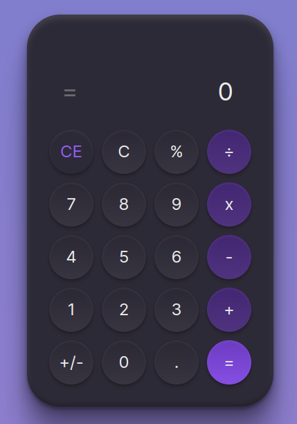

# calculator



Disponível em: https://calculadora-0ztz.onrender.com/

Calculadora feita com Vue 3 e Vite no desafio da @rocketseat #boraCodar

[Protótipo](https://www.figma.com/community/file/1202607074523509182)


## Project Setup

```sh
npm install
```

### Compile and Hot-Reload for Development

```sh
npm run dev
```

### Type-Check, Compile and Minify for Production

```sh
npm run build
```
